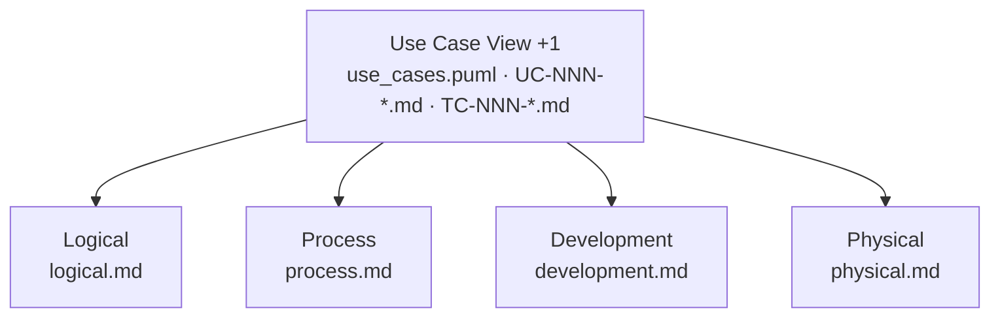
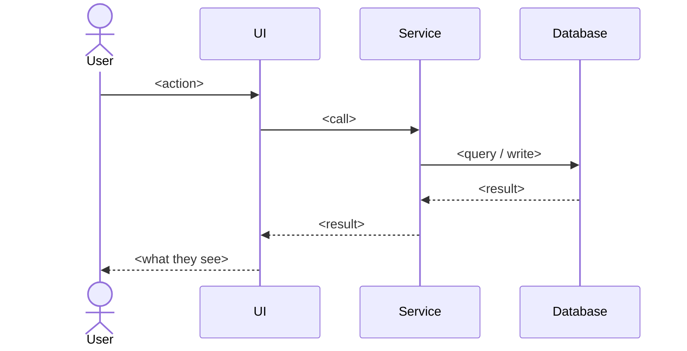
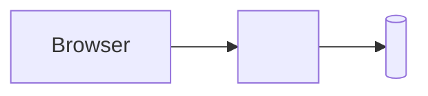

# Templates for the five views

Six files. Replace every `<…>` and delete every sentence that does not apply
to this project — a template sentence left in is worse than nothing, because
it reads as a decision somebody made.

Keep each view under roughly 200 lines. If one grows past that, the excess
almost always belongs in a use case specification or an ADR.

---

## `docs/architecture/README.md`

```markdown
# Architecture

The architecture of <project>, written as the four views Philippe Kruchten
described in 1995 — plus the fifth that ties them together, but in reverse
order. Kruchten put the scenarios last, to validate the other four. Here they
come first: a use case is the unit of work, and the other four views describe
how a use case turns into code.

These documents are **context for an AI coding agent**, not a wiki page. That
sets three rules:

- **Text, not pictures.** Diagrams are Mermaid or PlantUML so an agent can read
  and change them. A PNG it can only ignore.
- **In the repository, not beside it.** Architecture and code are versioned
  together and change in the same pull request.
- **Short, not complete.** What is not written here gets invented; what is
  written at length gets skimmed.

## The five views



| View | Question it answers | Where it lives |
|---|---|---|
| **Use Case (+1)** | What should the system do, and for whom? | [`../use_cases.puml`](../use_cases.puml), [`../use_cases/`](../use_cases), [`../test_cases/`](../test_cases) |
| **Logical** | Which business building blocks exist? | [`logical.md`](logical.md) + [`../entity_model.md`](../entity_model.md) |
| **Process** | How does the system behave at runtime? | [`process.md`](process.md) |
| **Development** | How is the code organized? | [`development.md`](development.md) + [`testing.md`](testing.md) |
| **Physical** | Where does the system run? | [`physical.md`](physical.md) |

The Use Case View deliberately sits outside `architecture/`. It is the base the
architecture is built on, not a part of it.

## What an agent reads, and when

| Task | Read first |
|---|---|
| Implement or change a use case | its `UC-NNN-*.md`, then [`development.md`](development.md) |
| Add an entity, attribute, or domain rule | [`logical.md`](logical.md), [`../entity_model.md`](../entity_model.md) |
| Touch a save, a transaction, or a lookup | [`process.md`](process.md) |
| Change the build, the stack, or a convention | [`development.md`](development.md) |
| Write or change a test | [`testing.md`](testing.md) |
| Change how or where the app is run | [`physical.md`](physical.md) |
| Make a decision that contradicts a view | [`adr/`](adr) — the same question has probably been answered once |

`CLAUDE.md` in the repository root is the short form of all of this: the entry
point that says which document to open for which task.

## One home per fact

Every rule is stated **once**, in the view it belongs to. The code conventions
are not a separate guidelines folder — they *are* the Development View,
together with [`testing.md`](testing.md) for the test conventions. `CLAUDE.md`
is the index, not a second copy.

When a document would have to repeat something another one already says, it
links instead. Two documents stating the same rule are one edit away from
contradicting each other, and nobody can tell which one is the lie.

**No business logic lives in this folder.** A rule about <domain nouns> belongs
to the use case that needs it, or to [`../business_rules.md`](../business_rules.md)
when several use cases share it. These documents say *where* a rule of a given
kind is honoured — that is an architectural decision and stays true however the
rules change.

The views are **prescriptive, not descriptive**: they say how a use case is to
be built, not what the code that exists happens to do. That is what lets the
same documents guide the first use case and the fiftieth — and why they name
patterns and use case ids rather than the classes of whichever use cases are
already implemented.

## Architecture Decision Records

The views describe the state. The ADRs describe why it is that state. An agent
facing the same question again reads them and decides the way the team decided,
instead of deciding anew.

| ADR | Decision |
|---|---|
| [ADR-001](adr/ADR-001-<slug>.md) | <one line> |

## Traceability

```
Requirement → Use Case → View → Code → Test
```

Worked example, end to end:

`<FR-NNN>` → [`<GR-NNN>`](../business_rules.md#<anchor>) → `<UC-NNN> <BR-NNN>`
→ <which view decides where this kind of rule is honoured> → <the module that
implements it> → a test method annotated
`@UseCase(id = "<UC-NNN>", businessRules = "<BR-NNN>", scenario = "<flow>")`.

<State which of these arrows are enforced by a sensor and which are
convention.>
```

---

## `docs/architecture/logical.md`

Answers: **which business building blocks exist, and what may each one know
about the others?**

```markdown
# Logical View

What the system is made of, in the vocabulary of the business. The structures
themselves are in [`../entity_model.md`](../entity_model.md); this document
says how they are grouped and which rules each grouping is responsible for.

## Building blocks

```mermaid
flowchart LR
    <A> --> <B>
    <A> --> <C>
```

| Block | Responsible for | Must not |
|---|---|---|
| <name> | <the decisions it owns> | <what it must never do> |

## Where a rule is honoured

The decision this view owns: given a rule, which layer enforces it.

| Kind of rule | Honoured in | Why |
|---|---|---|
| A format or a required value | <the form / the input binding> | the user must see it before saving |
| A rule needing another row | <the service> | it needs a query, and the form has no database |
| A rule the data must never break | a database constraint | it has to hold against every writer, not just this application |

A rule may appear in two of these. That is not duplication: the form gives the
message, the constraint is the backstop. <State the convention for which wins
and what the user sees when the backstop fires.>

## Invariants

<Statements true of every state of the system, regardless of use case. Keep
these very few — most "invariants" are business rules belonging to a use case.>
```

---

## `docs/architecture/process.md`

Answers: **what happens at runtime — concurrency, transactions, failure.**

```markdown
# Process View

## Runtime processes

| Process | What it is | Lifetime |
|---|---|---|
| <the application> | <single JVM / container / …> | <…> |
| <background jobs, if any> | <…> | <…> |

## A request, end to end



## Transactions

The decision this view owns: **where a transaction begins and ends.**

- <Which layer is the boundary.>
- <What is never inside one — a user interaction, a remote call, a sleep.>
- <What happens when one fails: what the user sees, what is logged.>

Two operations the user experiences as one step are <one transaction / two>.
<Say which, and what the consequence is when the second fails.>

## Concurrency

| Situation | Policy |
|---|---|
| Two users editing the same row | <optimistic locking / last write wins / …> |
| A long-running read | <…> |
| Session state | <where it lives, what happens on restart> |

## Failure

| Failure | Behaviour |
|---|---|
| The database is unreachable | <…> |
| A constraint fires that the form should have caught | <…> |
| An unhandled exception | <what the user sees, what is logged> |
```

---

## `docs/architecture/development.md`

Answers: **how is the code organised, and what are the conventions?** This is
the view an agent reads most often — it is the coding guidelines.

```markdown
# Development View

## Module layout

```
src/main/java/<base-package>/
├── <feature>/            one package per feature
│   ├── ui/               <…>
│   └── domain/           <…>
└── shared/               used by more than one feature
```

**Package by feature, not by layer.** Everything one feature needs is in one
place; a change to a feature touches one directory. <State the test for
whether something goes in `shared`.>

## Conventions

| Rule | Why | Enforced by |
|---|---|---|
| <one rule per row> | <one clause> | <ArchitectureTest.<ruleName> / review> |

<Every row with an enforcing rule must name a real test method. A row whose
"enforced by" column says "review" is a rule that will drift; say so honestly
rather than claiming an enforcement that does not exist.>

## Naming

| Thing | Pattern | Example |
|---|---|---|
| <…> | <…> | <…> |

## The build

| Command | Does |
|---|---|
| `<cheap sensor run>` | <seconds, no containers> |
| `<unit tests>` | <…> |
| `<full verify>` | <…> |

## Dependencies

<The allow list and the ban list, with one clause of reasoning each. If a
`rules/` or stack document already holds this, link to it and do not repeat
it here.>

## Agent guardrails

| Hook | Event | Enforces |
|---|---|---|
| <…> | <…> | <…> |

<Only if the project has them. Link to where they are specified.>
```

---

## `docs/architecture/testing.md`

Answers: **what kinds of test exist, what does each one cover, and what must
never appear in one?** Split out of the Development View because it is read on
a different task.

```markdown
# Testing

## The layers

| Layer | Suffix | Runs in | Covers | Cost |
|---|---|---|---|---|
| <sensors> | `*Test`, tagged `sensor` | <phase> | the repository against the specifications | seconds |
| <unit / browserless> | `*Test` | <phase> | one use case's flows | <…> |
| <end to end> | `*IT` | <phase> | a journey across use cases | <…> |

<State why the split exists and what would be wrong with merging them.>

## Naming

<The contract between a test and the specification it covers: class names,
annotations, what a sensor will reject.>

## What a test must assert

<The rule that separates a real test from one that only exists to satisfy a
sensor. Be concrete.>

## Test data

| Rule | Why |
|---|---|
| <where fixtures live> | <…> |
| <whether tests share a database> | <…> |
| <how isolation is achieved> | <…> |

## Coverage

<What is measured, how the layers are merged, what the gate is, and — more
importantly — what coverage does *not* tell you.>
```

---

## `docs/architecture/physical.md`

Answers: **where does it run?** Usually the shortest of the five. Keep it
honest: if there is no deployment yet, say so in one line.

```markdown
# Physical View

## Deployment



| Node | Runs | Notes |
|---|---|---|
| <…> | <…> | <…> |

## Environments

| Environment | Database | Data | Who reaches it |
|---|---|---|---|
| local | <…> | <…> | <…> |
| <…> | <…> | <…> | <…> |

## Configuration

| Setting | Source | Differs per environment |
|---|---|---|
| <…> | <…> | <…> |

<Where secrets come from, and the one rule: never from the repository.>

## Not yet decided

<List what is genuinely undecided. An agent that reads about a pipeline which
does not exist will write code for it. One line each is enough.>
```
