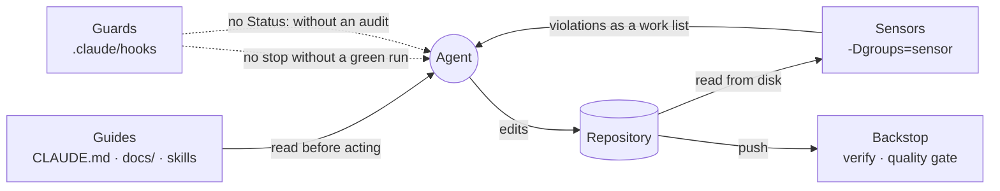

# The harness

How this plugin keeps an AI agent's output trustworthy. Not new machinery —
the skills, tests and hooks described elsewhere, seen as one system. This
document says how the parts fit together and, more usefully, **where a new
rule belongs**.

## Four layers

| Layer | Question it answers | Kind | Parts | Binds |
|---|---|---|---|---|
| **Guides** | What should the agent do, and how? | before, prose | `CLAUDE.md`, `docs/`, the 4+1 views, the ADRs, `rules/holon-stack.md`, the skills | whoever reads them |
| **Sensors** | Does the repository still agree with the guides? | after, code | `ArchitectureTest`, `TestLayerConventionsTest`, `SourceConventionsTest`, the three traceability tests; then the full suite | everyone, CI included |
| **Guards** | Did this session actually run the sensors? | during, hooks | `.claude/hooks/`, wired by `.claude/settings.json` | one Claude Code session |
| **Backstop** | Does it hold for everybody else? | after, CI | `mvn verify` on every push (`traceability-sensors/references/ci.md`) | every push |

**Guides** are feedforward. They shape what the agent writes before it writes
it, and they do so *probabilistically*: a rule in prose makes the right
outcome likelier, it does not prevent the wrong one. That is why they are
written for an agent — short, in text, one home per fact — and why `CLAUDE.md`
is an index naming the document to open for each task rather than a copy of it.

**Sensors** are feedback. They read the repository from disk and compare it
with the guides. They are deterministic, and they are built to be *read by the
agent*: every violation is listed at once and names the heading or rule it came
from, so a failure reads as a work list rather than a stack trace. Because they
carry the JUnit tag `sensor`, `mvn -q test -Dgroups=sensor` runs them in
seconds with no Docker — cheap enough to run every turn, which is the only
property that matters.

**Guards** close the loop. A sensor catches drift only once somebody runs it,
and whether it ran is a property of the session, not of the source tree. They
enforce exactly two things: a turn does not end while something under `src/`,
`docs/` or `pom.xml` changed after the last green run, and a `Status:` line
does not claim coverage unless `uc-coverage` audited it after the code last
changed.

**The backstop** is CI. Hooks fire only inside a Claude Code session, so CI
runs the full build for every push, whoever or whatever made the change. It
runs the sensors first and cheapest, then the unit tests, then the `*IT` layer
and the quality gate — so a specification that disagrees with the code fails in
seconds rather than after a Playwright run. One rule is easy to get backwards:
**never add a `paths-ignore: ['docs/**']` filter.** A docs-only edit is the most
likely way to break traceability, because renaming a flow heading invalidates
every annotation that names it.

## Where a new rule goes

The one decision this document exists to make:

> **If a rule can be checked by reading the repository, it is a test.
> Only a rule about what happened during a session is a hook.**

| The rule is about | Put it in | Because |
|---|---|---|
| Judgement, intent, style, "prefer X" | a guide | nothing can check it, and pretending otherwise produces a rule people route around |
| Anything visible in the code or the docs | a sensor | a test binds CI and every contributor, not just an agent |
| What happened in this session | a hook | nothing else can see it |

Hooks are the least portable, least testable and most intrusive layer. A
contributor without Claude Code gets the guides, the sensors and CI — not the
guards. That is why the guards enforce as little as possible, and why "the
test suffix is wrong" became `TestLayerConventionsTest` rather than a hook.

## The rules the harness is built on

- **Put each rule in the strongest layer that can hold it.** Working *down*
  this list — prose to test to hook — is almost always wrong. Working *up* it
  is the normal direction of travel: a convention starts as a sentence, and
  becomes a rule when it is broken twice.
- **A guard reads state, not tool calls.** A `Status:` line changed with `sed`
  counts the same as one changed with `Edit`. A guard that keys on the shape of
  a tool call is defeated by the next tool.
- **Evidence is positive.** A sensor run counts because its Surefire reports
  say it ran and passed after the last change — never because nothing failed on
  screen. An audit counts because the auditing agent finished, never because
  the agent said it did.
- **The honest fixes are always two:** write the missing code or test, or
  correct the specification or the status. Weakening a sensor is not one of
  them, and an agent under pressure will propose it.
- **Guards fail open.** A hook that cannot read its input exits quietly. A
  guardrail that breaks the session costs more than the drift it catches,
  because it gets deleted.
- **Cheap enough to run every turn.** A sensor nobody runs senses nothing.

## The status doctrine

`**Status:** Done` is not a label. It is an **executable assertion that
switches a coverage sensor on.**

| Document | Asserting value | What it claims |
|---|---|---|
| `UC-NNN` | `Done`, `Tested` | every flow — main, alternative, exception — has a test |
| `TC-NNN` | `Automated` | the whole Flow table runs end to end in one `*IT` |

Everything else — `Draft`, `Reviewed`, `Approved`, `Implemented`, `Obsolete` —
claims nothing and cannot be contradicted. `Implemented` is the interesting
one: it says the code exists, not that the flows are covered, which makes it
the honest status for work that is built but not yet fully tested.

This asymmetry is deliberate. **Referential integrity is checked for every
specification**: an annotation naming a flow that does not exist is always a
failure. **Coverage is checked only for specifications that claim
completion.** Because this process writes the specification before the code, an
unimplemented use case is a normal intermediate state, not an error — and a
harness that treated it as one would make the first hour of every project a
wall of red.

So the sensors get stricter exactly when the document says the work is done.
Raising the status is the act that turns the claim on, which is why it is the
one edit the guards refuse without evidence.

## One turn through the harness

Implementing UC-004 goes through every layer:

1. **Session start.** `session-start.sh` records the commit and time the
   session began on, and reads every `Status:` line once. Everything later is
   measured against that.
2. **Guides.** `CLAUDE.md` sends the agent to `UC-004-*.md`, from its `BR-NNN`
   to the shared `GR-NNN`, and to the Development View before it touches
   `src/main/java/`. `/implement` turns them into a view, a form and a service.
3. **Sensors.** `mvn -q test -Dgroups=sensor`. A view annotated
   `@Transactional` fails `ArchitectureTest` by name. A test annotated with a
   flow the specification calls something else fails
   `UseCaseTraceabilityTest` by name. The agent fixes the code, not the check.
4. **Guard on stopping.** Ending the turn without that run, or editing a file
   after it, is refused by `require-sensors.sh`, which names the command.
5. **Guard on status.** To mark UC-004 `Done`, `/coverage-check UC-004` runs
   first; its agent leaves a marker when it finishes. Without the marker the
   edit is refused, and a status changed some other way is reported afterwards.
6. **Backstop.** On push, CI runs the full build and the quality gate.

## What it does not do

- **It does not judge quality.** The sensors check that code follows the
  conventions and that a test exists for every flow. They cannot check that a
  test asserts the right thing — that is `/coverage-check` and code review.
- **Hooks are local.** See above. Keep them minimal.
- **There is one deliberate escape.** After one blocked `Stop`, the second is
  let through, so a session without a working build cannot loop forever. A turn
  that ends that way shows it in the transcript.

## Changing the harness

| You change | Also update | Then run |
|---|---|---|
| a convention in `holon-stack.md` | the matching rule in `ArchitectureTest` | `mvn -q test -Dgroups=sensor` |
| the specification format (`Status:`, ids, headings) | `SpecDocuments` and the templates in `aiup-core` | `mvn -q test -Dgroups=sensor` |
| a hook or `.claude/settings.json` | the table in `session-guards/SKILL.md` | `./.claude/hooks/smoke.sh` |
| the set of sensor classes | `AIUP_SENSORS` in `lib.sh` **and** `sensors_list` in `smoke.sh` | both |
| the CI workflows | `traceability-sensors/references/ci.md` | push a branch and watch it |
| what a layer is responsible for | an ADR | both |

The last row is the important one. A change to the division of labour between
layers is exactly the kind of decision that gets quietly reversed six months
later by someone who does not know it was a decision.
