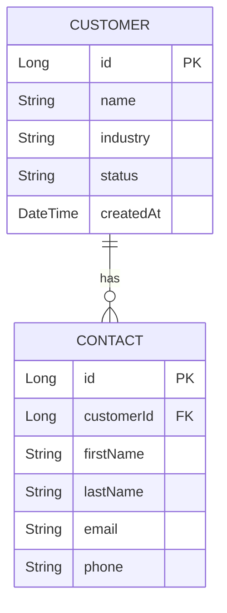

# Entity Model — Minimal CRM

Two entities: `Customer` (a company) and `Contact` (a person at that company).
Column names are `snake_case` of the JavaBean field names, matching the `@DataPath`
convention. Primary keys are backed by sequences (never `SERIAL` / `IDENTITY`).

## ER Diagram

## Entity: Customer

| Attribute | Type | `@DataPath` column | Validation |
|-----------|------|--------------------|------------|
| id | Long | `id` | Primary Key, Sequence |
| name | String(200) | `name` | Not Null, Unique |
| industry | String(100) | `industry` | Optional |
| status | String(20) | `status` | Not Null, Values: ACTIVE, ARCHIVED |
| createdAt | DateTime | `created_at` | Not Null |

## Entity: Contact

| Attribute | Type | `@DataPath` column | Validation |
|-----------|------|--------------------|------------|
| id | Long | `id` | Primary Key, Sequence |
| customerId | Long | `customer_id` | Not Null, Foreign Key (CUSTOMER.id) |
| firstName | String(100) | `first_name` | Not Null |
| lastName | String(100) | `last_name` | Not Null |
| email | String(200) | `email` | Not Null, Format: Email |
| phone | String(40) | `phone` | Optional |
