# Entity Model

> AI Unified Process (AIUP) entity model. Source of truth: `docs/requirements.md`.
> Covers the order-to-cash and procure-to-pay domain (sales, purchasing,
> inventory, quality, finance). Every categorical attribute (status, type,
> disposition, reason, method, region) is modelled through the shared
> `REFERENCE_CODE` lookup entity rather than an enum column — the `category`
> attribute on `REFERENCE_CODE` scopes each set of codes (e.g.
> `SALES_ORDER_STATUS`, `RMA_DISPOSITION`, `PAYMENT_METHOD`).
>
> **Platform boundary:** tenant lifecycle, tenant settings/branding, user
> authentication, roles, and SaaS billing are **not modelled here** — they are
> owned by the external `holon-saas` foundation (`tenant-core`, `tenant-data`,
> `tenant-settings`, `tenant-users`, `tenant-security`, `tenant-billing`,
> `tenant-onboarding`, `tenant-audit` modules), which uses Spring Security +
> Spring Data JPA rather than Holon Auth/Datastore (see `requirements.md`
> CON-S-010). `APP_USER` appears below only as a thin external reference so
> that user-audit FKs (e.g. `approved_by`, `inspector_id`) resolve.
>
> **Tenant isolation is physical, not logical:** per CON-T-001/CON-T-004,
> `holon-saas`'s `tenant-data` module provisions one database **schema per
> tenant** (`SCHEMA_PER_TENANT`) and transparently routes every JDBC
> connection to the current tenant's schema via `TenantAwareDataSource`
> (resolved from `TenantContext`). Consequently **no entity below carries a
> `tenant_id` column or a `TENANT` FK** — every table in this model is
> physically isolated by schema, so uniqueness constraints described as
> "unique per tenant" are simply `Not Null, Unique` within each tenant's
> schema. `TENANT` itself is therefore not modelled here at all; it is owned
> end-to-end by `holon-saas` `tenant-core`/`tenant-data`.

## Entity Relationship Diagram

```mermaid
erDiagram
    FISCAL_YEAR ||--o{ FISCAL_PERIOD : "divides into"

    TAX_CODE ||--o{ CUSTOMER : "default tax for"
    TAX_CODE ||--o{ QUOTE_LINE : "applies to"
    TAX_CODE ||--o{ SALES_ORDER_LINE : "applies to"
    TAX_CODE ||--o{ INVOICE_LINE : "applies to"

    CUSTOMER ||--o{ CONTACT : "has"
    CUSTOMER ||--o{ QUOTE : "requests"
    QUOTE ||--o{ QUOTE_LINE : "contains"
    PRODUCT ||--o{ QUOTE_LINE : "priced in"
    QUOTE ||--o| SALES_ORDER : "converts to"
    CUSTOMER ||--o{ SALES_ORDER : "places"
    SALES_ORDER ||--o{ SALES_ORDER_LINE : "contains"
    PRODUCT ||--o{ SALES_ORDER_LINE : "ordered as"
    SALES_ORDER ||--o{ INVOICE : "billed via"
    CUSTOMER ||--o{ INVOICE : "owes"
    INVOICE ||--o{ INVOICE_LINE : "contains"
    INVOICE ||--o{ PAYMENT : "settled by"
    CUSTOMER ||--o{ ACTIVITY : "logged for"
    APP_USER ||--o{ ACTIVITY : "logs"
    CUSTOMER ||--o{ SUBSCRIPTION : "subscribes to"
    SUBSCRIPTION ||--o{ INVOICE : "auto-generates"

    VENDOR ||--o{ RFQ : "receives"
    RFQ ||--o{ RFQ_LINE : "contains"
    PRODUCT ||--o{ RFQ_LINE : "quoted as"
    RFQ ||--o| PURCHASE_ORDER : "leads to"
    VENDOR ||--o{ PURCHASE_ORDER : "receives"
    PURCHASE_ORDER ||--o{ PURCHASE_ORDER_LINE : "contains"
    PRODUCT ||--o{ PURCHASE_ORDER_LINE : "ordered as"
    PURCHASE_ORDER ||--o{ GOODS_RECEIPT : "fulfilled by"
    GOODS_RECEIPT ||--o{ GOODS_RECEIPT_LINE : "contains"
    GOODS_RECEIPT ||--o{ BILL : "invoiced via"
    VENDOR ||--o{ BILL : "issues"
    BILL ||--o{ BILL_LINE : "contains"
    PAYMENT_BATCH ||--o{ PAYMENT_BATCH_LINE : "contains"
    BILL ||--o{ PAYMENT_BATCH_LINE : "settled by"
    VENDOR ||--o{ VENDOR_RETURN : "receives"
    VENDOR_RETURN ||--o{ VENDOR_RETURN_LINE : "contains"

    ITEM_GROUP ||--o{ PRODUCT : "groups"
    WAREHOUSE ||--o{ BIN : "contains"
    PRODUCT ||--o{ STOCK_BALANCE : "tracked as"
    BIN ||--o{ STOCK_BALANCE : "holds"
    STOCK_BALANCE ||--o{ STOCK_TRANSFER : "moved by"
    STOCK_BALANCE ||--o{ STOCK_ADJUSTMENT : "corrected by"
    PRODUCT ||--o{ COMPOSITE_ITEM : "assembled as"
    COMPOSITE_ITEM ||--o{ COMPOSITE_ITEM_COMPONENT : "consists of"
    PRODUCT ||--o{ COMPOSITE_ITEM_COMPONENT : "used as component"

    GOODS_RECEIPT ||--o{ QUALITY_INSPECTION : "inspected via"
    QUALITY_INSPECTION ||--o{ INSPECTION_LINE : "contains"
    QUALITY_INSPECTION ||--o| VENDOR_RETURN : "triggers"
    SALES_ORDER ||--o{ RMA : "returned via"
    QUALITY_INSPECTION ||--o| RMA : "triggers"
    RMA ||--o{ RMA_LINE : "contains"
    PRODUCT ||--o{ RMA_LINE : "returned as"

    FISCAL_PERIOD ||--o{ JOURNAL_ENTRY : "posted within"
    JOURNAL_ENTRY ||--o{ JOURNAL_LINE : "contains"
    CHART_OF_ACCOUNT ||--o{ JOURNAL_LINE : "posted to"

    REFERENCE_CODE ||--o{ QUOTE : "status of"
    REFERENCE_CODE ||--o{ SALES_ORDER : "status of"
    REFERENCE_CODE ||--o{ INVOICE : "status of"
    REFERENCE_CODE ||--o{ PAYMENT : "method of"
    REFERENCE_CODE ||--o{ ACTIVITY : "type of"
    REFERENCE_CODE ||--o{ RFQ : "status of"
    REFERENCE_CODE ||--o{ PURCHASE_ORDER : "status of"
    REFERENCE_CODE ||--o{ GOODS_RECEIPT : "status of"
    REFERENCE_CODE ||--o{ BILL : "status of"
    REFERENCE_CODE ||--o{ PAYMENT_BATCH : "status of"
    REFERENCE_CODE ||--o{ VENDOR_RETURN : "disposition of"
    REFERENCE_CODE ||--o{ STOCK_ADJUSTMENT : "reason of"
    REFERENCE_CODE ||--o{ STOCK_TRANSFER : "status of"
    REFERENCE_CODE ||--o{ QUALITY_INSPECTION : "result of"
    REFERENCE_CODE ||--o{ INSPECTION_LINE : "result of"
    REFERENCE_CODE ||--o{ RMA : "disposition of"
    REFERENCE_CODE ||--o{ JOURNAL_ENTRY : "status of"
```

---

## Platform & Tenant Configuration

### APP_USER

_External reference only — full schema, authentication, and role assignment owned by `holon-saas` `tenant-users` / `tenant-security` modules._

| Attribute | Description                          | Data Type | Length/Precision | Validation Rules      |
|-----------|----------------------------------------|-----------|-------------------|--------------------------|
| id        | Unique identifier (owned by holon-saas) | String     | 50                | Primary Key, Sequence    |

### FISCAL_YEAR

A tenant's 12-month accounting year with a defined start date.

| Attribute  | Description                  | Data Type | Length/Precision | Validation Rules                  |
|------------|-------------------------------|-----------|-------------------|-------------------------------------|
| id         | Unique identifier             | Long      | 19                | Primary Key, Sequence               |
| start_date | First day of the fiscal year  | Date      | -                 | Not Null                            |
| end_date   | Last day of the fiscal year   | Date      | -                 | Not Null                            |
| label      | Display label (e.g. FY2026)   | String    | 20                | Not Null                            |

**Constraints:** end_date must be after start_date.

### FISCAL_PERIOD

A monthly accounting period within a fiscal year, hard-locked once closed.

| Attribute     | Description                              | Data Type | Length/Precision | Validation Rules                          |
|---------------|--------------------------------------------|-----------|-------------------|----------------------------------------------|
| id            | Unique identifier                          | Long      | 19                | Primary Key, Sequence                        |
| fiscal_year_id| Owning fiscal year                         | Long      | 19                | Not Null, Foreign Key (FISCAL_YEAR.id)       |
| start_date    | First day of the period                    | Date      | -                 | Not Null                                     |
| end_date      | Last day of the period                     | Date      | -                 | Not Null                                     |
| is_closed     | Whether the period is hard-locked          | Boolean   | 1                 | Not Null                                     |
| closed_at     | Timestamp the period was closed            | DateTime  | -                 | Optional                                     |
| closed_by     | User who closed (or unlocked) the period   | String      | 50                | Optional, Foreign Key (APP_USER.id)          |

**Constraints:** end_date must be after start_date; no JOURNAL_ENTRY may reference a period where is_closed is true unless the period was explicitly unlocked by the CFO.

### TAX_CODE

A per-tenant tax rule (EU VAT standard/reduced/reverse-charge/exempt/export, US state sales tax, UK VAT).

| Attribute  | Description                       | Data Type | Length/Precision | Validation Rules                 |
|------------|-------------------------------------|-----------|-------------------|------------------------------------|
| id         | Unique identifier                  | Long      | 19                | Primary Key, Sequence              |
| code       | Tax code identifier                | String    | 20                | Not Null, Unique                   |
| rate       | Tax rate percentage                | Decimal   | 5,2               | Not Null, Min: 0, Max: 100         |
| is_default | Whether this is the tenant default | Boolean   | 1                 | Not Null                           |
| is_active  | Whether the code can be used       | Boolean   | 1                 | Not Null                           |

### NUMBERING_PATTERN

A per-tenant, per-document-type numbering scheme with year-reset and padding.

| Attribute      | Description                                      | Data Type | Length/Precision | Validation Rules                        |
|----------------|----------------------------------------------------|-----------|-------------------|--------------------------------------------|
| id             | Unique identifier                                 | Long      | 19                | Primary Key, Sequence                       |
| document_type  | Document type code (SO, INV, QU, PO, BIL, PAY, REC, JE, RMA) | String | 10        | Not Null, Values: SO, INV, QU, PO, BIL, PAY, REC, JE, RMA |
| prefix         | Prefix printed before the number                  | String    | 10                | Not Null                                    |
| padding_digits | Zero-padding width                                | Integer   | 10                | Not Null, Min: 1, Max: 10                   |
| year_reset     | Whether the counter resets at year boundary       | Boolean   | 1                 | Not Null                                    |
| current_value  | Last issued sequence value                        | Long      | 19                | Not Null                                    |

**Constraints:** document_type is unique (within the tenant's schema).

### REFERENCE_CODE

A shared, tenant-scoped lookup entity for every categorical attribute in the system (status, method, type, reason, disposition, region). The `category` attribute scopes each independent set of codes.

| Attribute | Description                                                        | Data Type | Length/Precision | Validation Rules       |
|-----------|----------------------------------------------------------------------|-----------|-------------------|--------------------------|
| id        | Unique identifier                                                    | Long      | 19                | Primary Key, Sequence    |
| category  | Code group (e.g. SALES_ORDER_STATUS, PAYMENT_METHOD, RMA_DISPOSITION) | String    | 50                | Not Null                 |
| code      | Short machine code within the category                              | String    | 30                | Not Null                 |
| label     | Human-readable label shown in the UI                                 | String    | 100               | Not Null                 |
| sort_order| Display order within the category                                   | Integer   | 10                | Not Null, Min: 0, Max: 999 |

**Constraints:** The combination of category and code is unique.

---

## Sales Cycle

### CUSTOMER

A buying organisation with its own billing, currency, and payment-term defaults.

| Attribute        | Description                          | Data Type | Length/Precision | Validation Rules                          |
|------------------|-----------------------------------------|-----------|-------------------|----------------------------------------------|
| id               | Unique identifier                     | Long      | 19                | Primary Key, Sequence                        |
| name             | Customer name                         | String    | 200               | Not Null                                     |
| customer_number  | Human-readable customer number        | String    | 20                | Not Null, Unique                             |
| billing_address  | Billing address                       | String    | 500               | Not Null                                     |
| tax_id           | Customer's tax identifier             | String    | 50                | Optional                                     |
| default_currency | ISO currency code                     | String    | 3                 | Not Null                                     |
| default_tax_code_id | Default tax applied to new documents | Long    | 19                | Not Null, Foreign Key (TAX_CODE.id)          |
| payment_terms_days | Standard payment term in days       | Integer   | 10                | Not Null, Min: 0, Max: 365                   |

**Constraints:** customer_number is unique (within the tenant's schema, CON-D-001).

### CONTACT

A named individual at a customer.

| Attribute   | Description               | Data Type | Length/Precision | Validation Rules                     |
|-------------|-----------------------------|-----------|-------------------|-----------------------------------------|
| id          | Unique identifier          | Long      | 19                | Primary Key, Sequence                   |
| customer_id | Owning customer            | Long      | 19                | Not Null, Foreign Key (CUSTOMER.id)     |
| full_name   | Contact's full name        | String    | 200               | Not Null                                |
| email       | Contact email address      | String    | 254               | Not Null, Format: Email                 |
| phone       | Contact phone number       | String    | 30                | Optional                                |
| job_title   | Contact's job title        | String    | 100               | Optional                                |

### QUOTE

A priced, time-boxed offer to a customer, convertible into a sales order.

| Attribute      | Description                        | Data Type | Length/Precision | Validation Rules                          |
|----------------|---------------------------------------|-----------|-------------------|----------------------------------------------|
| id             | Unique identifier                   | Long      | 19                | Primary Key, Sequence                        |
| customer_id    | Quoted customer                     | Long      | 19                | Not Null, Foreign Key (CUSTOMER.id)          |
| quote_number   | Human-readable quote number         | String    | 20                | Not Null, Unique                             |
| status_code    | Quote status                        | Long      | 19                | Not Null, Foreign Key (REFERENCE_CODE.id)    |
| valid_until    | Last date the quote can be accepted | Date      | -                 | Not Null                                     |
| currency       | ISO currency code                   | String    | 3                 | Not Null                                     |
| total_amount   | Sum of all quote lines              | Decimal   | 14,2              | Not Null, Min: 0, Max: 999999999999.99       |

### QUOTE_LINE

A single priced product line on a quote.

| Attribute     | Description                     | Data Type | Length/Precision | Validation Rules                     |
|---------------|-----------------------------------|-----------|-------------------|-----------------------------------------|
| id            | Unique identifier                | Long      | 19                | Primary Key, Sequence                   |
| quote_id      | Owning quote                     | Long      | 19                | Not Null, Foreign Key (QUOTE.id)        |
| product_id    | Quoted product                   | Long      | 19                | Not Null, Foreign Key (PRODUCT.id)      |
| quantity      | Quantity quoted                  | Decimal   | 12,2              | Not Null, Min: 0.01, Max: 999999.99     |
| unit_price    | Price per unit                   | Decimal   | 10,2              | Not Null, Min: 0, Max: 9999999.99       |
| discount_pct  | Line-level discount percentage   | Decimal   | 5,2               | Not Null, Min: 0, Max: 100              |
| tax_code_id   | Tax applied to this line         | Long      | 19                | Not Null, Foreign Key (TAX_CODE.id)     |

### SALES_ORDER

A confirmed customer commitment to buy, converted from a quote or created directly.

| Attribute      | Description                        | Data Type | Length/Precision | Validation Rules                          |
|----------------|---------------------------------------|-----------|-------------------|----------------------------------------------|
| id             | Unique identifier                   | Long      | 19                | Primary Key, Sequence                        |
| customer_id    | Ordering customer                   | Long      | 19                | Not Null, Foreign Key (CUSTOMER.id)          |
| quote_id       | Source quote, if converted          | Long      | 19                | Optional, Foreign Key (QUOTE.id)             |
| order_number   | Human-readable order number         | String    | 20                | Not Null, Unique                             |
| status_code    | Order status                        | Long      | 19                | Not Null, Foreign Key (REFERENCE_CODE.id)    |
| order_date     | Date the order was confirmed        | Date      | -                 | Not Null                                     |
| currency       | ISO currency code                   | String    | 3                 | Not Null                                     |
| total_amount   | Sum of all order lines              | Decimal   | 14,2              | Not Null, Min: 0, Max: 999999999999.99       |

**Constraints:** Once invoiced, a sales order cannot be deleted, only voided with a reversing invoice (CON-D-005).

### SALES_ORDER_LINE

A single ordered product line, with allocations to fulfilment.

| Attribute       | Description                             | Data Type | Length/Precision | Validation Rules                     |
|-----------------|---------------------------------------------|-----------|-------------------|-----------------------------------------|
| id              | Unique identifier                        | Long      | 19                | Primary Key, Sequence                   |
| sales_order_id  | Owning sales order                       | Long      | 19                | Not Null, Foreign Key (SALES_ORDER.id)  |
| product_id      | Ordered product                          | Long      | 19                | Not Null, Foreign Key (PRODUCT.id)      |
| quantity        | Quantity ordered                         | Decimal   | 12,2              | Not Null, Min: 0.01, Max: 999999.99     |
| unit_price      | Price per unit                           | Decimal   | 10,2              | Not Null, Min: 0, Max: 9999999.99       |
| tax_code_id     | Tax applied to this line                 | Long      | 19                | Not Null, Foreign Key (TAX_CODE.id)     |
| allocated_quantity | Quantity allocated to shipments so far | Decimal   | 12,2              | Not Null, Min: 0, Max: 999999.99        |

**Constraints:** The sum of allocations on a sales order must equal the order quantity per line (CON-D-013).

### INVOICE

A billing document issued against a sales order, full or partial.

| Attribute      | Description                        | Data Type | Length/Precision | Validation Rules                          |
|----------------|---------------------------------------|-----------|-------------------|----------------------------------------------|
| id             | Unique identifier                   | Long      | 19                | Primary Key, Sequence                        |
| customer_id    | Billed customer                     | Long      | 19                | Not Null, Foreign Key (CUSTOMER.id)          |
| sales_order_id | Source sales order                  | Long      | 19                | Not Null, Foreign Key (SALES_ORDER.id)       |
| invoice_number | Human-readable invoice number       | String    | 20                | Not Null, Unique                             |
| status_code    | Invoice status                      | Long      | 19                | Not Null, Foreign Key (REFERENCE_CODE.id)    |
| issue_date     | Date the invoice was issued         | Date      | -                 | Not Null                                     |
| due_date       | Payment due date                    | Date      | -                 | Not Null                                     |
| currency       | ISO currency code                   | String    | 3                 | Not Null                                     |
| total_amount   | Sum of all invoice lines            | Decimal   | 14,2              | Not Null, Min: 0, Max: 999999999999.99       |

**Constraints:** due_date must be after issue_date.

### INVOICE_LINE

A single billed product line on an invoice.

| Attribute   | Description                     | Data Type | Length/Precision | Validation Rules                     |
|-------------|------------------------------------|-----------|-------------------|-----------------------------------------|
| id          | Unique identifier                 | Long      | 19                | Primary Key, Sequence                   |
| invoice_id  | Owning invoice                    | Long      | 19                | Not Null, Foreign Key (INVOICE.id)      |
| product_id  | Billed product                    | Long      | 19                | Not Null, Foreign Key (PRODUCT.id)      |
| quantity    | Quantity billed                   | Decimal   | 12,2              | Not Null, Min: 0.01, Max: 999999.99     |
| unit_price  | Price per unit                    | Decimal   | 10,2              | Not Null, Min: 0, Max: 9999999.99       |
| tax_code_id | Tax applied to this line          | Long      | 19                | Not Null, Foreign Key (TAX_CODE.id)     |

### PAYMENT

A payment received from a customer against one or more invoices.

| Attribute        | Description                     | Data Type | Length/Precision | Validation Rules                          |
|------------------|-------------------------------------|-----------|-------------------|----------------------------------------------|
| id               | Unique identifier                 | Long      | 19                | Primary Key, Sequence                        |
| invoice_id       | Settled invoice                   | Long      | 19                | Not Null, Foreign Key (INVOICE.id)           |
| payment_number   | Human-readable payment number     | String    | 20                | Not Null, Unique                             |
| method_code      | Payment method                    | Long      | 19                | Not Null, Foreign Key (REFERENCE_CODE.id)    |
| received_at      | Date/time payment was received    | DateTime  | -                 | Not Null                                     |
| amount           | Amount received                   | Decimal   | 14,2              | Not Null, Min: 0.01, Max: 999999999999.99    |

**Constraints:** A payment cannot be deleted; reversal is a refund payment (CON-D-010).

### ACTIVITY

A logged interaction (call, email, meeting, note) tied to a customer.

| Attribute   | Description                  | Data Type | Length/Precision | Validation Rules                          |
|-------------|---------------------------------|-----------|-------------------|----------------------------------------------|
| id          | Unique identifier              | Long      | 19                | Primary Key, Sequence                        |
| customer_id | Related customer               | Long      | 19                | Not Null, Foreign Key (CUSTOMER.id)          |
| app_user_id | User who logged the activity   | String      | 50                | Not Null, Foreign Key (APP_USER.id)          |
| type_code   | Activity type                  | Long      | 19                | Not Null, Foreign Key (REFERENCE_CODE.id)    |
| occurred_at | Date/time of the activity      | DateTime  | -                 | Not Null                                     |
| notes       | Free-text notes                | String    | 2000              | Optional                                     |

### SUBSCRIPTION

A recurring billing arrangement for a customer with automatic invoice generation.

| Attribute       | Description                          | Data Type | Length/Precision | Validation Rules                       |
|-----------------|------------------------------------------|-----------|-------------------|-------------------------------------------|
| id              | Unique identifier                      | Long      | 19                | Primary Key, Sequence                     |
| customer_id     | Subscribing customer                   | Long      | 19                | Not Null, Foreign Key (CUSTOMER.id)       |
| product_id      | Subscribed product/service             | Long      | 19                | Not Null, Foreign Key (PRODUCT.id)        |
| billing_cycle   | Recurrence cycle                       | String    | 20                | Not Null, Values: MONTHLY, QUARTERLY, ANNUAL |
| next_invoice_date | Date the next invoice will be generated | Date    | -                 | Not Null                                  |
| amount          | Recurring amount per cycle             | Decimal   | 10,2              | Not Null, Min: 0.01, Max: 9999999.99      |
| is_active       | Whether the subscription is active     | Boolean   | 1                 | Not Null                                  |

---

## Purchasing Cycle

### VENDOR

A supplying organisation with its own bank details, currency, and payment-term defaults.

| Attribute        | Description                          | Data Type | Length/Precision | Validation Rules                          |
|------------------|-----------------------------------------|-----------|-------------------|----------------------------------------------|
| id               | Unique identifier                     | Long      | 19                | Primary Key, Sequence                        |
| name             | Vendor name                           | String    | 200               | Not Null                                     |
| vendor_number    | Human-readable vendor number          | String    | 20                | Not Null, Unique                             |
| address          | Vendor address                        | String    | 500               | Not Null                                     |
| tax_id           | Vendor's tax identifier               | String    | 50                | Optional                                     |
| bank_iban        | Vendor's IBAN for SEPA payments       | String    | 34                | Not Null                                     |
| default_currency | ISO currency code                     | String    | 3                 | Not Null                                     |
| payment_terms_days | Standard payment term in days       | Integer   | 10                | Not Null, Min: 0, Max: 365                   |

**Constraints:** vendor_number is unique (within the tenant's schema, CON-D-002).

### RFQ

A request for quotation sent to one or more vendors.

| Attribute      | Description                        | Data Type | Length/Precision | Validation Rules                          |
|----------------|---------------------------------------|-----------|-------------------|----------------------------------------------|
| id             | Unique identifier                   | Long      | 19                | Primary Key, Sequence                        |
| vendor_id      | Vendor solicited                    | Long      | 19                | Not Null, Foreign Key (VENDOR.id)            |
| rfq_number     | Human-readable RFQ number            | String    | 20                | Not Null, Unique                             |
| status_code    | RFQ status                          | Long      | 19                | Not Null, Foreign Key (REFERENCE_CODE.id)    |
| required_by    | Date the quote is required          | Date      | -                 | Not Null                                     |

### RFQ_LINE

A single requested product line on an RFQ, with the vendor's quoted price.

| Attribute   | Description                     | Data Type | Length/Precision | Validation Rules                 |
|-------------|------------------------------------|-----------|-------------------|-------------------------------------|
| id          | Unique identifier                 | Long      | 19                | Primary Key, Sequence               |
| rfq_id      | Owning RFQ                        | Long      | 19                | Not Null, Foreign Key (RFQ.id)      |
| product_id  | Requested product                 | Long      | 19                | Not Null, Foreign Key (PRODUCT.id)  |
| quantity    | Quantity requested                | Decimal   | 12,2              | Not Null, Min: 0.01, Max: 999999.99 |
| quoted_price| Vendor's quoted unit price        | Decimal   | 10,2              | Optional                            |
| lead_time_days | Vendor's quoted lead time       | Integer   | 10                | Not Null, Min: 0, Max: 365           |

### PURCHASE_ORDER

A binding commitment to a vendor, placed from a selected RFQ quote or from scratch.

| Attribute      | Description                        | Data Type | Length/Precision | Validation Rules                          |
|----------------|---------------------------------------|-----------|-------------------|----------------------------------------------|
| id             | Unique identifier                   | Long      | 19                | Primary Key, Sequence                        |
| vendor_id      | Ordered vendor                      | Long      | 19                | Not Null, Foreign Key (VENDOR.id)            |
| rfq_id         | Source RFQ, if applicable           | Long      | 19                | Optional, Foreign Key (RFQ.id)               |
| po_number      | Human-readable PO number            | String    | 20                | Not Null, Unique                             |
| status_code    | PO status                           | Long      | 19                | Not Null, Foreign Key (REFERENCE_CODE.id)    |
| expected_receipt_date | Expected goods-receipt date  | Date      | -                 | Not Null                                     |
| ship_to_warehouse_id | Destination warehouse         | Long      | 19                | Not Null, Foreign Key (WAREHOUSE.id)         |
| total_amount   | Sum of all PO lines                 | Decimal   | 14,2              | Not Null, Min: 0, Max: 999999999999.99       |

**Constraints:** Once received, a purchase order cannot be deleted, only voided with a reversing goods receipt and bill (CON-D-006).

### PURCHASE_ORDER_LINE

A single ordered product line on a purchase order.

| Attribute          | Description                     | Data Type | Length/Precision | Validation Rules                             |
|--------------------|------------------------------------|-----------|-------------------|-------------------------------------------------|
| id                 | Unique identifier                 | Long      | 19                | Primary Key, Sequence                           |
| purchase_order_id  | Owning purchase order              | Long      | 19                | Not Null, Foreign Key (PURCHASE_ORDER.id)       |
| product_id         | Ordered product                    | Long      | 19                | Not Null, Foreign Key (PRODUCT.id)              |
| quantity           | Quantity ordered                   | Decimal   | 12,2              | Not Null, Min: 0.01, Max: 999999.99             |
| unit_price         | Price per unit                     | Decimal   | 10,2              | Not Null, Min: 0, Max: 9999999.99               |

### GOODS_RECEIPT

A confirmed delivery against a purchase order.

| Attribute         | Description                       | Data Type | Length/Precision | Validation Rules                          |
|-------------------|--------------------------------------|-----------|-------------------|----------------------------------------------|
| id                | Unique identifier                   | Long      | 19                | Primary Key, Sequence                        |
| purchase_order_id | Source purchase order               | Long      | 19                | Not Null, Foreign Key (PURCHASE_ORDER.id)    |
| receipt_number    | Human-readable receipt number       | String    | 20                | Not Null, Unique                             |
| status_code       | Receipt status (received, back-ordered, damaged) | Long | 19        | Not Null, Foreign Key (REFERENCE_CODE.id)    |
| received_at       | Date/time goods were received       | DateTime  | -                 | Not Null                                     |
| received_by       | User who recorded the receipt       | String      | 50                | Not Null, Foreign Key (APP_USER.id)          |

### GOODS_RECEIPT_LINE

A single received product line, with bin assignment.

| Attribute        | Description                     | Data Type | Length/Precision | Validation Rules                            |
|------------------|------------------------------------|-----------|-------------------|-------------------------------------------------|
| id               | Unique identifier                 | Long      | 19                | Primary Key, Sequence                           |
| goods_receipt_id | Owning goods receipt              | Long      | 19                | Not Null, Foreign Key (GOODS_RECEIPT.id)        |
| product_id       | Received product                  | Long      | 19                | Not Null, Foreign Key (PRODUCT.id)              |
| bin_id           | Bin the goods were placed into    | Long      | 19                | Not Null, Foreign Key (BIN.id)                  |
| quantity         | Quantity received                 | Decimal   | 12,2              | Not Null, Min: 0.01, Max: 999999.99             |

### BILL

A vendor invoice, 3-way-matched against the purchase order and goods receipt before payment.

| Attribute         | Description                       | Data Type | Length/Precision | Validation Rules                          |
|-------------------|--------------------------------------|-----------|-------------------|----------------------------------------------|
| id                | Unique identifier                   | Long      | 19                | Primary Key, Sequence                        |
| vendor_id         | Billing vendor                      | Long      | 19                | Not Null, Foreign Key (VENDOR.id)            |
| goods_receipt_id  | Matched goods receipt               | Long      | 19                | Not Null, Foreign Key (GOODS_RECEIPT.id)     |
| bill_number       | Human-readable bill number          | String    | 20                | Not Null, Unique                             |
| status_code       | Bill status                         | Long      | 19                | Not Null, Foreign Key (REFERENCE_CODE.id)    |
| due_date          | Payment due date                    | Date      | -                 | Not Null                                     |
| currency          | ISO currency code                   | String    | 3                 | Not Null                                     |
| total_amount      | Sum of all bill lines               | Decimal   | 14,2              | Not Null, Min: 0, Max: 999999999999.99       |
| is_match_blocked  | Whether 3-way match failed and payment is blocked | Boolean | 1        | Not Null                                     |

**Constraints:** 3-way match (PO = goods receipt = bill) is required at the line level within ±0.01 unit-price tolerance before payment is allowed (CON-F-008).

### BILL_LINE

A single billed product line on a vendor bill.

| Attribute   | Description                     | Data Type | Length/Precision | Validation Rules                     |
|-------------|------------------------------------|-----------|-------------------|-----------------------------------------|
| id          | Unique identifier                 | Long      | 19                | Primary Key, Sequence                   |
| bill_id     | Owning bill                       | Long      | 19                | Not Null, Foreign Key (BILL.id)         |
| product_id  | Billed product                    | Long      | 19                | Not Null, Foreign Key (PRODUCT.id)      |
| quantity    | Quantity billed                   | Decimal   | 12,2              | Not Null, Min: 0.01, Max: 999999.99     |
| unit_price  | Price per unit                    | Decimal   | 10,2              | Not Null, Min: 0, Max: 9999999.99       |

### PAYMENT_BATCH

A SEPA (or single-wire) outgoing payment run, subject to 4-eyes approval above the tenant threshold.

| Attribute        | Description                        | Data Type | Length/Precision | Validation Rules                          |
|------------------|----------------------------------------|-----------|-------------------|----------------------------------------------|
| id               | Unique identifier                    | Long      | 19                | Primary Key, Sequence                        |
| batch_number     | Human-readable batch number          | String    | 20                | Not Null, Unique                             |
| status_code      | Batch status                         | Long      | 19                | Not Null, Foreign Key (REFERENCE_CODE.id)    |
| scheduled_date   | Date the batch is scheduled to execute | Date    | -                 | Not Null                                     |
| total_amount     | Sum of all batch lines               | Decimal   | 14,2              | Not Null, Min: 0, Max: 999999999999.99       |
| approved_by      | Secondary approver for 4-eyes payments | String    | 50                | Optional, Foreign Key (APP_USER.id)          |
| xml_hash         | SHA-256 hash of the generated pain.001.001.03 XML | String | 64        | Not Null                                     |

### PAYMENT_BATCH_LINE

A single vendor bill included in a payment batch.

| Attribute        | Description                     | Data Type | Length/Precision | Validation Rules                          |
|------------------|------------------------------------|-----------|-------------------|----------------------------------------------|
| id               | Unique identifier                 | Long      | 19                | Primary Key, Sequence                        |
| payment_batch_id | Owning payment batch               | Long      | 19                | Not Null, Foreign Key (PAYMENT_BATCH.id)     |
| bill_id          | Settled bill                       | Long      | 19                | Not Null, Foreign Key (BILL.id)              |
| amount           | Amount paid for this bill          | Decimal   | 14,2              | Not Null, Min: 0.01, Max: 999999999999.99    |
| early_pay_discount | Discount captured for early payment | Decimal | 10,2              | Optional                                     |

### VENDOR_RETURN

A reverse-flow return to a vendor for defective or wrong goods (vendor RMA).

| Attribute         | Description                        | Data Type | Length/Precision | Validation Rules                          |
|-------------------|----------------------------------------|-----------|-------------------|----------------------------------------------|
| id                | Unique identifier                    | Long      | 19                | Primary Key, Sequence                        |
| vendor_id         | Vendor the return is issued to       | Long      | 19                | Not Null, Foreign Key (VENDOR.id)            |
| quality_inspection_id | Failed inspection that triggered the return | Long | 19          | Optional, Foreign Key (QUALITY_INSPECTION.id)|
| return_number     | Human-readable return number         | String    | 20                | Not Null, Unique                             |
| status_code       | Workflow status (request, RMA, receive, inspect, refund/credit) | Long | 19  | Not Null, Foreign Key (REFERENCE_CODE.id)    |
| disposition_code  | Final disposition                    | Long      | 19                | Not Null, Foreign Key (REFERENCE_CODE.id)    |
| requested_at      | Date the return was requested        | Date      | -                 | Not Null                                     |

**Constraints:** A return cannot be deleted; closure only, with disposition recorded (CON-D-011).

### VENDOR_RETURN_LINE

A single returned product line on a vendor return.

| Attribute        | Description                     | Data Type | Length/Precision | Validation Rules                              |
|------------------|------------------------------------|-----------|-------------------|--------------------------------------------------|
| id               | Unique identifier                 | Long      | 19                | Primary Key, Sequence                            |
| vendor_return_id | Owning vendor return               | Long      | 19                | Not Null, Foreign Key (VENDOR_RETURN.id)         |
| product_id       | Returned product                   | Long      | 19                | Not Null, Foreign Key (PRODUCT.id)               |
| quantity         | Quantity returned                  | Decimal   | 12,2              | Not Null, Min: 0.01, Max: 999999.99              |
| defect_notes     | Description of the defect          | String    | 1000              | Optional                                         |

---

## Inventory

### ITEM_GROUP

A product family sharing variant axes (size, color, material) for controlled SKU generation.

| Attribute | Description                | Data Type | Length/Precision | Validation Rules                 |
|-----------|-------------------------------|-----------|-------------------|-------------------------------------|
| id        | Unique identifier            | Long      | 19                | Primary Key, Sequence                |
| name      | Product family name          | String    | 100               | Not Null                             |
| variant_axes | Comma-separated variant axis names (e.g. size, color) | String | 200 | Optional                             |

### PRODUCT

A sellable/purchasable item, identified by a tenant-unique SKU.

| Attribute      | Description                        | Data Type | Length/Precision | Validation Rules                          |
|----------------|---------------------------------------|-----------|-------------------|----------------------------------------------|
| id             | Unique identifier                   | Long      | 19                | Primary Key, Sequence                        |
| item_group_id  | Product family, if any              | Long      | 19                | Optional, Foreign Key (ITEM_GROUP.id)        |
| sku            | Stock-keeping unit code             | String    | 50                | Not Null, Unique                             |
| name           | Product name                        | String    | 200               | Not Null                                     |
| is_composite   | Whether this product is a kit/BOM   | Boolean   | 1                 | Not Null                                     |
| unit_cost      | Standard/average unit cost          | Decimal   | 10,2              | Not Null, Min: 0, Max: 9999999.99            |
| unit_price     | Standard list price                 | Decimal   | 10,2              | Not Null, Min: 0, Max: 9999999.99            |

**Constraints:** SKU is unique (within the tenant's schema, CON-D-003).

### WAREHOUSE

A physical location where inventory is stored.

| Attribute | Description        | Data Type | Length/Precision | Validation Rules                 |
|-----------|-----------------------|-----------|-------------------|-------------------------------------|
| id        | Unique identifier     | Long      | 19                | Primary Key, Sequence                |
| name      | Warehouse name        | String    | 100               | Not Null                             |
| address   | Physical address      | String    | 500               | Not Null                             |

### BIN

A physical storage location (zone + bin) within a warehouse.

| Attribute     | Description                 | Data Type | Length/Precision | Validation Rules                          |
|---------------|--------------------------------|-----------|-------------------|----------------------------------------------|
| id            | Unique identifier             | Long      | 19                | Primary Key, Sequence                        |
| warehouse_id  | Owning warehouse              | Long      | 19                | Not Null, Foreign Key (WAREHOUSE.id)         |
| zone          | Zone code within the warehouse| String    | 20                | Not Null                                     |
| bin_code      | Bin identifier within the zone| String    | 20                | Not Null                                     |

**Constraints:** Bin location (zone + bin_code) is unique per warehouse (CON-D-004).

### STOCK_BALANCE

The current on-hand quantity of a product in a specific bin.

| Attribute | Description                | Data Type | Length/Precision | Validation Rules                     |
|-----------|--------------------------------|-----------|-------------------|-----------------------------------------|
| id        | Unique identifier             | Long      | 19                | Primary Key, Sequence                   |
| product_id| Tracked product                | Long      | 19                | Not Null, Foreign Key (PRODUCT.id)      |
| bin_id    | Bin holding the stock           | Long      | 19                | Not Null, Foreign Key (BIN.id)          |
| quantity  | Current on-hand quantity        | Decimal   | 12,2              | Not Null, Min: 0, Max: 9999999.99       |

**Constraints:** Stock balance must never go negative; a transfer/ship/adjustment that would take it negative is rejected (CON-D-012).

### STOCK_TRANSFER

A movement of stock between bins or warehouses, with in-transit tracking.

| Attribute        | Description                     | Data Type | Length/Precision | Validation Rules                          |
|-------------------|------------------------------------|-----------|-------------------|----------------------------------------------|
| id                | Unique identifier                 | Long      | 19                | Primary Key, Sequence                        |
| product_id        | Transferred product                | Long      | 19                | Not Null, Foreign Key (PRODUCT.id)           |
| from_bin_id       | Source bin                         | Long      | 19                | Not Null, Foreign Key (BIN.id)               |
| to_bin_id         | Destination bin                    | Long      | 19                | Not Null, Foreign Key (BIN.id)               |
| quantity          | Quantity transferred               | Decimal   | 12,2              | Not Null, Min: 0.01, Max: 999999.99          |
| status_code       | Transfer status (in-transit, completed) | Long | 19               | Not Null, Foreign Key (REFERENCE_CODE.id)    |
| transferred_at    | Date/time of the transfer          | DateTime  | -                 | Not Null                                     |

### STOCK_ADJUSTMENT

A manual correction to a bin's stock balance (cycle count, write-off, write-on, damage).

| Attribute     | Description                    | Data Type | Length/Precision | Validation Rules                          |
|---------------|-----------------------------------|-----------|-------------------|----------------------------------------------|
| id            | Unique identifier                | Long      | 19                | Primary Key, Sequence                        |
| product_id    | Adjusted product                 | Long      | 19                | Not Null, Foreign Key (PRODUCT.id)           |
| bin_id        | Adjusted bin                     | Long      | 19                | Not Null, Foreign Key (BIN.id)               |
| quantity_delta| Signed quantity change           | Decimal   | 12,2              | Not Null                                     |
| reason_code   | Adjustment reason                | Long      | 19                | Not Null, Foreign Key (REFERENCE_CODE.id)    |
| adjusted_by   | User who performed the adjustment| String      | 50                | Not Null, Foreign Key (APP_USER.id)          |
| adjusted_at   | Date/time of the adjustment       | DateTime  | -                 | Not Null                                     |

### COMPOSITE_ITEM

A kit/BOM header defining how a finished product is built from components.

| Attribute  | Description                     | Data Type | Length/Precision | Validation Rules                     |
|------------|------------------------------------|-----------|-------------------|-----------------------------------------|
| id         | Unique identifier                 | Long      | 19                | Primary Key, Sequence                   |
| product_id | Finished product this kit builds  | Long      | 19                | Not Null, Foreign Key (PRODUCT.id)      |
| built_quantity_per_run | Finished quantity produced per build | Integer | 10        | Not Null, Min: 1, Max: 9999              |

**Constraints:** A composite-item build cannot be reversed by deleting the build record; reversal is a tear-down build with opposite quantities (CON-D-009).

### COMPOSITE_ITEM_COMPONENT

A single component product and quantity required to build one composite item.

| Attribute          | Description                     | Data Type | Length/Precision | Validation Rules                             |
|--------------------|------------------------------------|-----------|-------------------|--------------------------------------------------|
| id                 | Unique identifier                 | Long      | 19                | Primary Key, Sequence                            |
| composite_item_id  | Owning composite item              | Long      | 19                | Not Null, Foreign Key (COMPOSITE_ITEM.id)        |
| component_product_id | Component product                | Long      | 19                | Not Null, Foreign Key (PRODUCT.id)                |
| quantity_required  | Quantity of the component per build| Decimal   | 12,2              | Not Null, Min: 0.01, Max: 999999.99              |

---

## Quality

### QUALITY_INSPECTION

An AQL-based inspection performed on an incoming goods receipt.

| Attribute        | Description                        | Data Type | Length/Precision | Validation Rules                          |
|-------------------|----------------------------------------|-----------|-------------------|----------------------------------------------|
| id                | Unique identifier                    | Long      | 19                | Primary Key, Sequence                        |
| goods_receipt_id  | Inspected goods receipt              | Long      | 19                | Not Null, Foreign Key (GOODS_RECEIPT.id)     |
| inspector_id      | Inspector who performed the inspection | String    | 50                | Not Null, Foreign Key (APP_USER.id)          |
| sample_size       | Number of units sampled              | Integer   | 10                | Not Null, Min: 1, Max: 9999                  |
| result_code       | Overall inspection result            | Long      | 19                | Not Null, Foreign Key (REFERENCE_CODE.id)    |
| inspected_at      | Date/time of the inspection          | DateTime  | -                 | Not Null                                     |

### INSPECTION_LINE

A single sampled unit's pass/fail result within an inspection.

| Attribute            | Description                  | Data Type | Length/Precision | Validation Rules                          |
|----------------------|---------------------------------|-----------|-------------------|----------------------------------------------|
| id                   | Unique identifier             | Long      | 19                | Primary Key, Sequence                        |
| quality_inspection_id| Owning inspection              | Long      | 19                | Not Null, Foreign Key (QUALITY_INSPECTION.id)|
| unit_number          | Sequence number of the sampled unit | Integer | 10             | Not Null, Min: 1, Max: 9999                  |
| result_code          | Pass/fail result for this unit | Long      | 19                | Not Null, Foreign Key (REFERENCE_CODE.id)    |
| defect_type          | Type of defect observed, if failed | String | 100               | Optional                                     |

### RMA

A customer sales return, opened from a defect report and dispositioned by quality.

| Attribute        | Description                        | Data Type | Length/Precision | Validation Rules                          |
|-------------------|----------------------------------------|-----------|-------------------|----------------------------------------------|
| id                | Unique identifier                    | Long      | 19                | Primary Key, Sequence                        |
| sales_order_id    | Original sales order                 | Long      | 19                | Not Null, Foreign Key (SALES_ORDER.id)       |
| quality_inspection_id | Related inspection, if any        | Long      | 19                | Optional, Foreign Key (QUALITY_INSPECTION.id)|
| rma_number        | Human-readable RMA number             | String    | 20                | Not Null, Unique                             |
| status_code       | Workflow status (request, RMA, receive, inspect, refund/credit) | Long | 19  | Not Null, Foreign Key (REFERENCE_CODE.id)    |
| disposition_code  | Final disposition (restock, return-to-vendor, scrap, credit-only) | Long | 19 | Not Null, Foreign Key (REFERENCE_CODE.id)   |
| requested_at      | Date the return was requested        | Date      | -                 | Not Null                                     |

**Constraints:** A return (RMA) cannot be deleted; closure only, with disposition recorded (CON-D-011).

### RMA_LINE

A single returned product line on a customer RMA.

| Attribute   | Description                   | Data Type | Length/Precision | Validation Rules                     |
|-------------|-----------------------------------|-----------|-------------------|-----------------------------------------|
| id          | Unique identifier                | Long      | 19                | Primary Key, Sequence                   |
| rma_id      | Owning RMA                       | Long      | 19                | Not Null, Foreign Key (RMA.id)          |
| product_id  | Returned product                 | Long      | 19                | Not Null, Foreign Key (PRODUCT.id)      |
| quantity    | Quantity returned                | Decimal   | 12,2              | Not Null, Min: 0.01, Max: 999999.99     |
| defect_notes| Description of the reported defect| String   | 1000              | Optional                                |

---

## Finance

### CHART_OF_ACCOUNT

A tenant's general-ledger account, mappable to the group's consolidated chart of accounts.

| Attribute       | Description                      | Data Type | Length/Precision | Validation Rules                  |
|-----------------|--------------------------------------|-----------|-------------------|--------------------------------------|
| id              | Unique identifier                   | Long      | 19                | Primary Key, Sequence                |
| account_code    | Account code                        | String    | 20                | Not Null, Unique                     |
| account_name    | Account name                        | String    | 200               | Not Null                             |
| account_type    | Balance sheet vs. P&L classification| String    | 20                | Not Null, Values: ASSET, LIABILITY, EQUITY, REVENUE, EXPENSE |
| is_active       | Whether the account accepts postings| Boolean   | 1                 | Not Null                             |

### JOURNAL_ENTRY

An immutable, hash-chained accounting entry auto-posted for every financially significant event.

| Attribute        | Description                                  | Data Type | Length/Precision | Validation Rules                          |
|-------------------|--------------------------------------------------|-----------|-------------------|----------------------------------------------|
| id                | Unique identifier                              | Long      | 19                | Primary Key, Sequence                        |
| fiscal_period_id  | Period the entry is posted into                | Long      | 19                | Not Null, Foreign Key (FISCAL_PERIOD.id)     |
| entry_number      | Human-readable journal entry number            | String    | 20                | Not Null, Unique                             |
| status_code       | Entry status (posted, reversed)                | Long      | 19                | Not Null, Foreign Key (REFERENCE_CODE.id)    |
| posted_at         | Date/time the entry was posted                 | DateTime  | -                 | Not Null                                     |
| previous_hash     | Hash of the prior entry in the chain           | String    | 64                | Not Null                                     |
| content_hash      | SHA-256 hash of date, accounts, amounts, narration | String | 64                | Not Null                                     |
| entry_hash        | SHA-256(previous_hash + content_hash)          | String    | 64                | Not Null, Unique                             |
| reverses_entry_id | Original entry this one reverses, if any       | Long      | 19                | Optional, Foreign Key (JOURNAL_ENTRY.id)     |

**Constraints:** A journal entry, once posted, is immutable; reversal is a new entry pointing back via reverses_entry_id (CON-F-003, CON-D-007). No entry may post to a fiscal period where FISCAL_PERIOD.is_closed is true.

### JOURNAL_LINE

A single debit or credit line within a journal entry.

| Attribute        | Description                     | Data Type | Length/Precision | Validation Rules                             |
|-------------------|------------------------------------|-----------|-------------------|--------------------------------------------------|
| id                | Unique identifier                 | Long      | 19                | Primary Key, Sequence                            |
| journal_entry_id  | Owning journal entry               | Long      | 19                | Not Null, Foreign Key (JOURNAL_ENTRY.id)         |
| account_id        | Posted general-ledger account      | Long      | 19                | Not Null, Foreign Key (CHART_OF_ACCOUNT.id)      |
| debit_amount      | Debit amount (0 if this is a credit line) | Decimal | 14,2         | Not Null, Min: 0, Max: 999999999999.99           |
| credit_amount     | Credit amount (0 if this is a debit line)| Decimal | 14,2          | Not Null, Min: 0, Max: 999999999999.99           |
| narration         | Line description                   | String    | 500               | Optional                                         |

**Constraints:** For a given journal_entry_id, the sum of debit_amount must equal the sum of credit_amount (CON-F-001).

### FX_RATE

A daily foreign-exchange rate captured from ECB/Fed sources for a currency pair.

| Attribute      | Description                    | Data Type | Length/Precision | Validation Rules                   |
|----------------|------------------------------------|-----------|-------------------|---------------------------------------|
| id             | Unique identifier                 | Long      | 19                | Primary Key, Sequence                 |
| from_currency  | Source ISO currency code          | String    | 3                 | Not Null                              |
| to_currency    | Target ISO currency code          | String    | 3                 | Not Null                              |
| rate_date      | Date the rate applies to          | Date      | -                 | Not Null                              |
| rate           | Exchange rate value               | Decimal   | 18,8              | Not Null, Min: 0.00000001, Max: 999999.99999999 |

**Constraints:** The combination of from_currency, to_currency, and rate_date is unique (within the tenant's schema).
