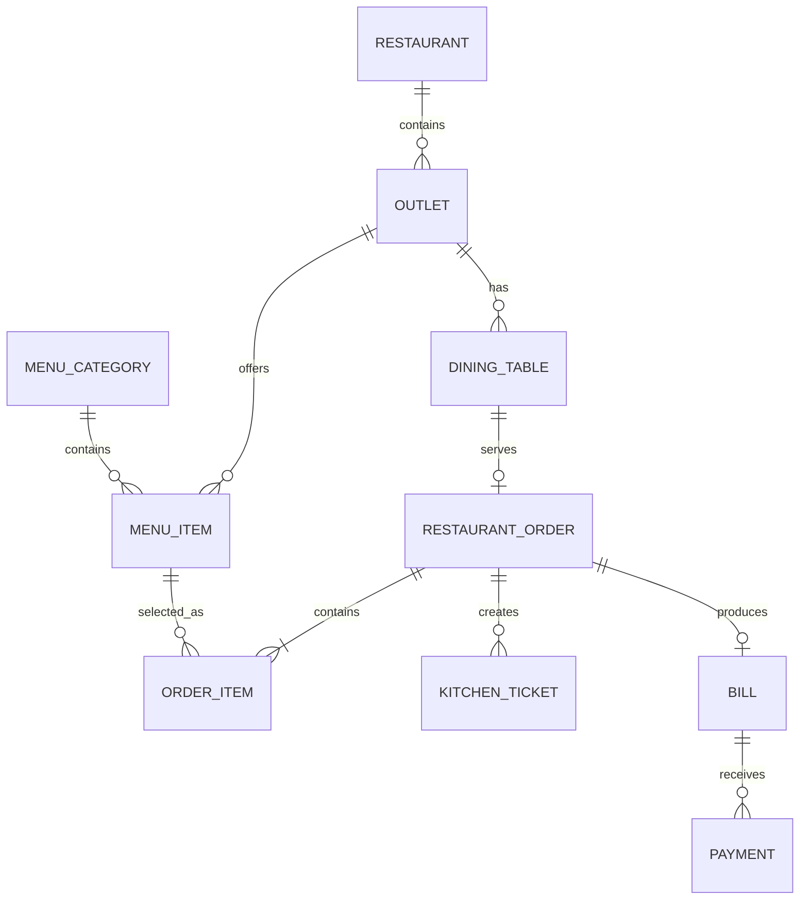

# RestoPro — Entity Model

The first vertical slice needs only the entities required to take and track a dine-in order.

## Entities

### Restaurant

- id
- name

### Outlet

- id
- restaurantId
- name
- address
- active

### DiningTable

- id
- outletId
- tableNumber
- seats
- status

### MenuCategory

- id
- name
- displayOrder
- active

### MenuItem

- id
- categoryId
- outletId
- name
- price
- active

### RestaurantOrder

- id
- outletId
- tableId
- orderNumber
- orderType
- status
- createdAt
- notes

### OrderItem

- id
- orderId
- menuItemId
- quantity
- unitPrice
- status

### KitchenTicket

- id
- orderId
- status
- createdAt
- readyAt

### Bill

- id
- orderId
- subtotal
- discount
- cgst
- sgst
- total
- status

### Payment

- id
- billId
- method
- amount
- paidAt
- reference

## Modeling rule

The UI does not define these entities by itself. Entities are derived from approved business requirements and use cases; UI evidence can expose missing fields or relationships and should trigger review rather than silent domain invention.
